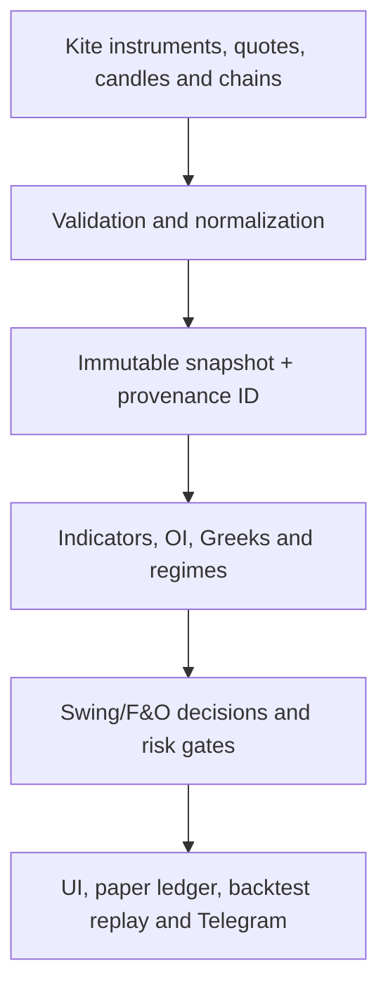

# NSEScanner / MarketScannerByDev — Final Audit and Build Handoff

**Audit date:** 18 July 2026 (IST)  
**Assessment:** source, screenshots, Telegram, market-rule verification, signal methodology, accounting, security, UI and release readiness  
**Source archive:** `marketscannerbydev-src(1).zip`  
**Source SHA-256:** `24f946642bae0126424c4752d298de3cda0cf271a64f4659bd1369e535968fc9`  
**Screenshot archive:** `marketscannerbydev.zip`  
**Screenshot SHA-256:** `61bca24b55d8ac7df21980ec90a8e5f25cd731e7bd13779502b2be6536e21fdf`  

> This is an engineering and trading-system integrity assessment, not a profit promise or investment recommendation. No analytical system can make Swing or F&O signals “perfect,” and no honest release gate can guarantee a money-generating machine. The correct target is reproducible data, explicit uncertainty, positive out-of-sample expectancy after all costs, bounded risk, and fail-closed execution.

## 1. Final verdict

The project has a broad and valuable analytical feature set, but the supplied build is **not ready for unattended paper automation or real-money execution**. It can continue as an owner-only research and shadow-trading tool after the Phase-0 patch, with broker execution kept disabled.

The most important conclusion is that the application previously mixed three different levels of truth:

1. **Display truth:** a number is available to show.
2. **Research truth:** a delayed or reconstructed number is adequate for analysis.
3. **Trade truth:** the exact contract, fresh quote, session, liquidity, ledger and risk evidence have all passed.

Several pages presented display/research data with “live,” “trade-grade,” “buy,” “writer flow,” or automation-adjacent language. That is more dangerous than a cosmetic bug because it changes how a trader interprets confidence.

### Release disposition

| Capability | Verdict after this patch | Required before promotion |
|---|---|---|
| Owner-only analysis UI | Conditional use | Every value must show source, timestamp, session and grade |
| Scanner research | Usable with provenance labels | Remove special-series noise; validate complete-bar coverage |
| OI/option-chain research | Usable with market-state labels | Persist and replay raw Kite snapshots for independent proof |
| Swing signals | Shadow-only | Fresh Kite signal/level/entry data; sufficient walk-forward sample |
| F&O signals | Shadow-only | Exact master contract, fresh Kite chain, liquidity, costs and replay proof |
| Paper trading | New opens fail closed on ledger drift | Repair historical ledger, then prove zero drift over 30 sessions |
| Telegram | Research/health alerts only | Deduplication, delivery receipts, source grade and market-state templates |
| Broker/live execution | **Disabled** | Formal go-live review after every release gate below passes |

## 2. Evidence scope and limitations

### Supplied evidence

- Source export: 1,549 archive entries and 1,482 extracted files.
- TypeScript/TSX source and test files for API, UI, DB schema and trading logic.
- Screenshot archive: 46 PNG files covering Home, Scanner, Sectors, Option Chain, Portfolio Analyser and OI Lab. Twenty-nine screenshots are from OI Lab.
- Two Telegram screenshots showing weekend pre/post-market tests and a degraded/read-only system-mode alert.
- A previously attached text file intended to contain additional conversation/reply material was empty (0 bytes), so no Replit Agent reply could be authenticated from it.

### Missing evidence

The source export has no root `package.json`, root lockfile, root TypeScript configuration, root test configuration, Git history or deployed commit SHA. It also does not include an anonymised database snapshot or raw provider-response archive. Therefore this audit could not:

- run the repository's real install, typecheck, migration and test commands;
- prove the deployed website is byte-for-byte equal to the uploaded source;
- independently reconstruct displayed OI totals, fills or historical P&L;
- validate Telegram delivery logs, deduplication state or retry behavior;
- certify all routes/tabs from screenshots, because screenshots for many tabs were not in the 46-file archive.

This is why the deliverable is a Phase-0 safety patch plus a gated roadmap, not a false “everything is perfect” certification.

## 3. Online rule and market-data verification

The following high-impact facts were cross-checked against current primary or authoritative sources.

| Fact | Verified result | Source | Project implication |
|---|---|---|---|
| NSE index/stock derivative expiry | Tuesday for contracts covered by the post-1 September 2025 convention | [NSE circular FAOP/68747](https://nsearchives.nseindia.com/web/sites/default/files/inline-files/FAOP68747.pdf), [NSE contract specifications](https://www.nseindia.com/static/products-services/equity-derivatives-contract-specifications) | NIFTY Tuesday; BANKNIFTY last-Tuesday monthly logic |
| BSE SENSEX derivative expiry | Thursday convention | [BSE derivative market information](https://beta.bseindia.com/static/markets/Derivatives/DeriReports/market_information.html) | SENSEX cannot reuse NIFTY Tuesday logic |
| NSE index option exercise style | European | [NSE Clearing settlement mechanism](https://www.nseclearing.in/clearing-settlement/equity-derivatives/settlement-mechanism) | “American exercise” education text was factually wrong |
| Current NSE lot-size revision | NIFTY 65 and BANKNIFTY 30 for applicable 2026 contracts | [NSE circular FAOP/70616](https://nsearchives.nseindia.com/content/circulars/FAOP70616.pdf) | Lot size must come from the exact instrument master; static values are fallback only |
| Options/futures STT from 1 April 2026 | Options premium/exercise 0.15%; futures 0.05% | [Union Budget 2026 speech](https://www.indiabudget.gov.in/doc/budget_speech.pdf) | Old 0.10% projection understated costs |
| Exchange option transaction rates used by the model | NSE 0.03503%; BSE 0.0325% | [Zerodha charge revision explanation](https://zerodha.com/z-connect/business-updates/revision-in-exchange-transaction-charges-and-securities-transaction-tax-from-october-1-2024) | SENSEX must use BSE rather than NSE charges |
| NSE 2026 trading holidays | Published official list, with later amendments/special sessions | [NSE 2026 holiday circular](https://nsearchives.nseindia.com/content/circulars/CMTR71775.pdf), [15 January amendment](https://nsearchives.nseindia.com/content/circulars/CMTR72260.pdf), [1 February special session](https://nsearchives.nseindia.com/content/circulars/CMTR72349.pdf) | Weekend/holiday logic must be exchange-session aware, not weekday-only |
| RBI FY2026-27 MPC schedule | Decision days: 8 Apr, 5 Jun, 5 Aug, 7 Oct, 4 Dec 2026 and 5 Feb 2027 | RBI schedule cross-check; the RBI page is bot-protected, corroborated by the published schedule reported [here](https://economictimes.indiatimes.com/news/economy/policy/reserve-bank-of-india-releases-mpc-meeting-schedule-of-the-monetary-policy-committee-for-2026-2027/articleshow/129751853.cms) | The previous list used wrong dates, including Saturday 6 June |
| Fed/ECB/BoE/BoJ calendars | Several dates in the app were stale or guessed | [Federal Reserve](https://www.federalreserve.gov/monetarypolicy/fomccalendars.htm), [ECB](https://www.ecb.europa.eu/press/calendars/mgcgc/html/index.en.html), [Bank of England](https://www.bankofengland.co.uk/news/2025/september/monetary-policy-committee-dates-for-2026), [Bank of Japan](https://www.boj.or.jp/en/mopo/mpmsche_minu/m_ref/mref250731a.pdf) | Updated 2026 entries; provisional 2027 entries remain display-only and cannot drive automation |

### Data authenticity checks from the screenshots

- The displayed PCR calculation was internally consistent: put OI 19.76 divided by call OI 12.22 is approximately 1.62.
- The displayed NIFTY spot of 24,334.30 was consistent with the 17 July 2026 closing context checked during the audit.
- Current OI totals, per-strike OI and max pain could **not** be independently authenticated without the exact raw Kite chain response, instrument token, expiry and capture timestamp.
- A mathematically correct PCR or max-pain result is not a directional forecast. It is a snapshot statistic and must not be narrated as guaranteed bullish/bearish flow.

## 4. Confirmed stop-ship defects and remediation status

| ID | Severity | Defect | Evidence/impact | Patch status |
|---|---:|---|---|---|
| P0-01 | Stop-ship | Wrong BANKNIFTY/SENSEX expiry rules | Wrong contract/DTE/force-close/backtest regime | Fixed in configs/tests; exact-master trade gate added |
| P0-02 | Stop-ship | Swing path used Yahoo-derived levels and historical day-open fill | Impossible fill, provenance breach, biased P&L | Kite-first shared daily bars; LTP entry; Yahoo blocked |
| P0-03 | Stop-ship | Paper ledger drift and incomplete reconciliation identity | Screenshot drift **+₹7,99,772.78** | Capital events added to identity; new F&O/EQ opens now fail closed |
| P0-04 | Stop-ship | Public/admin authorization weakness and exposed operational material in backup docs | PII/diagnostics/secrets risk | Owner checks hardened in patched routes; credentials still require rotation outside source |
| P0-05 | Stop-ship | Execution-critical gates failed open | Missing chain/DB/cost evidence could pass | Chain, liquidity, recent-stop DB and cost/edge paths made fail closed |
| P1-01 | High | Scanner page badge overstated row truth | Yahoo indicator rows looked trade-grade | Per-row grade and INFO labeling implemented |
| P1-02 | High | NSE scanner universe included BE/BZ/SM/ST and other special series | 8,864-row noise and unusable symbols | Explicit special-series filter and fixtures added |
| P1-03 | High | OI Lab said LIVE and inferred writer flow after close or with ΔOI=0 | False flow narrative | Market-state contract and snapshot-only/zero-change copy added |
| P1-04 | High | Option education said NSE options were American style | Factual error | Corrected to European exercise |
| P1-05 | High | Long-put theoretical max profit presented as bounded scenario | Risk-label error | Theoretical payoff separated from 2-sigma scenario range |
| P1-06 | High | Strategy suggestions ignored quote quality/IV evidence | Non-executable recommendations | Suggestions require tight quotes and known IV |
| P1-07 | High | F&O costs used stale STT/exchange assumptions and NSE rate for SENSEX | Inflated backtest/paper expectancy | Versioned 2026 rates; exchange propagated through closes/reports/backtests |
| P1-08 | High | P&L overview mixed lifetime and selected-period values | 60% overview vs 42.9% setup and empty month | Period scorecard now prioritizes monthly report; lifetime drawdown labelled |
| P1-09 | High | Economic/event calendars contained wrong and guessed controls | Could block/unblock the wrong day | Current 2026 dates corrected; blackout control now confirmed decisions only |
| P1-10 | High | F&O skip-reason UI omitted backend reasons | Silent/unknown rejection display | UI union, labels, copy and tones synchronized |
| P2-01 | Medium | Generic sector assignment defeated sector-relative Swing filter | Weak sectors could pass | Canonical symbol-sector mapping is used |
| P2-02 | Medium | System-mode Telegram leaked raw internal driver codes | Poor operator actionability | Driver codes humanized; diagnostics link retained |

### The ledger finding is still unresolved operationally

The screenshot shows approximately:

```text
actual F&O cash              ₹10,06,281
seed capital                ₹ 2,00,000
closed net trading P&L      ₹    6,508 (displayed context)
unexplained drift           ₹ 7,99,772.78
```

The patch **does not rewrite that money**. It prevents both paper entry lanes from opening new trades when the append-only trade and capital-event history cannot reproduce `paper_account.balance`; exits remain available. Repair requires an owner-approved database incident procedure:

1. Snapshot the database and export every F&O/EQ trade, account mutation, charge and capital event.
2. Identify the first sequence where cash no longer equals the journal-derived balance.
3. Classify the cause: duplicate credit, legacy daily reset, stale-close omission, manual top-up without event, migration or writer-version split.
4. Insert a documented adjustment event only after the cause and amount are signed off.
5. Never silently set balance back to seed and never rewrite historical trades.

## 5. Is the website analysis genuine?

### Genuine components

The code contains real implementations for indicator calculation, option chains, OI aggregation, Greeks, max pain, signal gates, risk sizing, paper positions, reports, Telegram schedules and backtesting. The application is not a static mock-up.

Several numbers shown in screenshots were internally coherent, and the Telegram weekend logic correctly stated that markets were closed and broker execution was disabled. The degraded alert also correctly moved the system to read-only when Kite session and DB health failed.

### Components that were overstated or not yet validated

| Claim/surface | Audit conclusion |
|---|---|
| “Live/trade-grade” scanner recommendation | Not genuine when the indicator inputs were Yahoo daily data; only the displayed quote could be Kite |
| OI “writer flow” with ΔOI=0 | Not genuine as a flow inference; zero change is a positioning snapshot |
| Post-close LIVE OI | Incorrect session semantics; values are frozen snapshots |
| Strategy “best/worst” | Previously mixed theoretical and scenario bounds |
| Swing fill | Previously could use a price from before the signal existed |
| F&O recommendation | Not executable unless exact token/expiry, fresh Kite chain, tight spread, sufficient OI and costs all pass |
| Backtest profitability | The supplied result is negative and too small to validate an edge |
| Paper P&L/equity | Not trustworthy until the ₹7.99 lakh ledger drift is reconstructed |

The correct description today is: **a serious research platform under remediation, not a validated automated trading system**.

## 6. Swing-trading deep review

### Patched execution contract

A Swing paper entry now requires all of the following:

- a scanner row whose row-level and detailed provenance both say fresh Kite/trade-grade;
- `STRONG_BUY` plus the configured score floor;
- F&O-equity-universe eligibility;
- sector not in the bottom quartile, using the canonical sector map;
- volume ratio at or above the confirmation floor;
- ATR(14) and 20-session swing low from the shared Kite-first daily-bar adapter;
- trigger-time LTP as entry, not the historical session open;
- stop between configured sanity bounds;
- account drawdown, heat, daily-count, concurrent-count and balance gates;
- a reconciled paper cash ledger.

Yahoo daily candles may still support research display, but they cannot open automatic, manual or staged Swing paper positions.

### Remaining methodology weaknesses

- A fixed `STRONG_BUY` score is not a calibrated probability. It needs per-setup reliability curves.
- The F&O-equity universe should be derived from the current contract master rather than a static set.
- Volume ratio and daily indicators need explicit completed-bar semantics; intraday partial-day volume cannot be compared naïvely with full-day averages.
- Corporate actions, symbol changes, splits, dividends and delistings require point-in-time adjusted history.
- Sector mapping requires an effective date; current sector membership applied to old history creates look-ahead bias.
- A long-only Swing engine needs regime controls for index trend, breadth, volatility and gap risk, but those controls must be tested rather than tuned to recent losses.
- Entry simulation needs bid/ask/slippage or a declared next-bar/next-open rule. LTP is safer than the prior historical open but is still not guaranteed fill price.

### Swing acceptance gate

Do not promote to live execution until each setup has at least 250 independent out-of-sample signals across bull, bear, sideways and high-volatility regimes, with positive net expectancy after fees/slippage and a confidence interval that does not rely on one stock or one month.

## 7. F&O deep review

### Contract identity

F&O risk is contract-specific. The correct invariant is:

```text
underlying + exchange + expiry + strike + option type
→ exact current instrument-master row
→ instrument token + lot size + tick size + freeze quantity
```

The patched open path blocks any display-only, corrected-nearest or tokenless contract. “Nearest expiry” may be useful in the UI but cannot silently become the traded contract.

### Data and liquidity

Only a complete, fresh Kite option chain may drive an F&O entry. Yahoo/NSE fallback values can support research only. Entry requires a valid premium plan, trusted quote, spread threshold, OI threshold and known chain. Missing evidence is a rejection, not permission.

### Costs and payoff

The canonical F&O model now includes 2026 STT, correct NSE/BSE exchange rates, brokerage, SEBI charge, GST, stamp duty, spread and slippage. Costs are included in paper close/report/backtest paths and the cost-to-edge guard is active.

The static ledger projection is labelled `FNO_V2_2026Q2_NSE_PROJECTION`; the close writer is authoritative and uses BSE for SENSEX. Historical rows retain their original version rather than being silently recomputed.

### OI, PCR, max pain and Greeks

- PCR is descriptive, not a direction oracle.
- Max pain is expiry-sensitive and can change; it is not a target.
- OI is positioning; writer/long-unwinding narratives require genuine interval change plus price/volume context.
- Greeks depend on IV, time-to-expiry, rate, dividend assumptions and exercise model. They must display inputs/as-of time.
- Bid/ask and depth matter more than model value for execution.
- Never combine snapshots from different expiry, source, market state or capture ID into one conclusion.

### F&O signal acceptance gate

Each strategy and index needs a separate walk-forward record. Require at least 300 out-of-sample trades per setup/index/DTE bucket where feasible, positive expectancy after all modelled costs, stable performance across regimes, bounded tail loss, and no result dominated by one expiry day.

## 8. Backtesting audit

The captured F&O backtest result is not evidence of an edge:

- 25 trades;
- 20% win rate;
- approximately **−₹20,538**;
- 19 of 133 candidate events outside the declared session in one diagnostic;
- delta-proxy replay rather than fully authenticated historical option premium/fill data.

That result should be labelled **experimental/failed**, not optimized into profitability by changing thresholds on the same sample.

### Required rebuild

1. Store point-in-time instrument masters and actual option OHLC/bid-ask/OI snapshots.
2. Use one canonical calendar, expiry and cost service shared with production.
3. Enforce entry-time knowledge: no future daily close, revised symbol list or final-day volume.
4. Add latency, spread, slippage, brokerage, taxes, rejected/partial fills and quantity freezes.
5. Use anchored walk-forward splits and purged/embargoed validation where labels overlap.
6. Report trade count, exposure, drawdown duration, profit factor, expectancy, turnover and confidence intervals—not win rate alone.
7. Keep an untouched final holdout. Threshold changes invalidate the prior holdout.
8. Reconcile every replay decision to a stored input snapshot ID and model version.

## 9. Portfolio and charting review

### Portfolio

The portfolio analyser has useful allocation, concentration and risk concepts, but must distinguish:

- live holdings from manually entered/watchlist positions;
- cost basis from current value;
- realized from unrealized P&L;
- current exposure from target allocation;
- data not available from zero;
- current sector classification from historical classification.

Every holding should use the same canonical quote snapshot as scanner/chart for the selected refresh. ETF, index and equity instruments need separate metadata; “NSE EQ” is not a sector.

### Charting

The captured chart showed stale/provenance and missing-volume concerns. The professional contract is:

- visible provider, exchange, interval, candle-close state and last update;
- OHLCV arrays validated as complete tuples;
- no joining candles from one provider with indicators from another without an explicit composite label;
- corporate-action adjustment policy;
- session gaps preserved;
- chart annotations linked to the signal snapshot and version that produced them.

## 10. Telegram review and target design

### Supplied messages

- Weekend pre-market: correct “markets closed” and “no F&O or Swing activity expected.”
- Weekend post-market: correct “no market session today.”
- Both correctly say broker execution disabled.
- Degraded/read-only alert is directionally correct, but raw driver codes were operator-hostile. The patch humanizes them while preserving diagnostic context.

### Required templates

Every trading alert should include:

```text
Environment and mode: SHADOW / PAPER / LIVE
Market state: PRE-OPEN / OPEN / CLOSED / SPECIAL SESSION
Signal ID and snapshot ID
Instrument: exchange, exact tradingsymbol/token, expiry/strike/type where applicable
Source and freshness: provider, captured-at, age, trade grade
Setup: version, direction, confidence/calibration bucket
Plan: entry policy, stop, targets, size, maximum rupee risk
Liquidity: bid, ask, spread, OI/depth
Costs: estimated round-trip and expected edge after costs
Action: research only / staged approval / paper opened / rejected
Rejection reason when blocked
```

Operational messages need a durable deduplication key, send-attempt record, Telegram response/message ID, retry state and final delivery status. A process-local “already sent” flag is insufficient after restart.

## 11. UI cleanup without feature loss

The UI should be reorganised rather than stripped. Preserve analytical capabilities but reduce repeated truth claims and duplicated cards.

### Global shell

- One compact top status strip: market state, system mode, Kite, DB, snapshot age and broker state.
- One global source-grade component with the same vocabulary everywhere.
- Replace multiple “live/healthy” badges with one canonical status; child cards show only exceptions.
- Group navigation into Market, F&O, Swing, Portfolio, Research, Reports and System.
- Hide advanced diagnostics behind an operator drawer while keeping them accessible.

### Page hierarchy

Each tab should render in this order:

1. Decision headline and market/source state.
2. Actionable or research-only result.
3. Risk/uncertainty and “why not tradable.”
4. Primary table/chart.
5. Advanced diagnostics and methodology.

### Terminology rules

- Use **LIVE** only while the exchange is open and the snapshot is within the contract freshness limit.
- Use **SNAPSHOT** after close.
- Use **TRADE-GRADE** only if every input required for the decision is trade-grade.
- Use **INFO/RESEARCH** rather than Buy/Sell when execution is blocked.
- Use **scenario best/worst** rather than theoretical best/worst when payoff is unbounded or bounded only by an assumed move.
- Use `— / unavailable` rather than zero for missing data.

## 12. One canonical data pipeline

Every tab should consume one immutable snapshot envelope rather than fetching and reinterpreting market data independently.



Minimum envelope:

```text
snapshot_id, captured_at, exchange_session_id, market_state
provider, provider_request_id, source_timestamp, received_timestamp
instrument_master_version, exchange, tradingsymbol, instrument_token
expiry, strike, option_type, lot_size, tick_size
quality_grade, stale, delayed, completeness, warnings
raw_payload_hash, normalization_version, model_version
```

The scanner, sectors, option chain, OI, strategies, portfolio, charts, reports, backtest and Telegram then reference the same snapshot ID. This removes cross-tab disagreement by construction.

## 13. Phased build roadmap

### Phase 0 — Truth and safety patch (included)

- Correct current expiry, exercise, lot/cost, session and calendar facts.
- Block Swing and F&O opens without trade-grade provenance.
- Block both paper entry lanes on ledger drift; preserve exits.
- Correct OI/strategy/scanner/report labels.
- Keep broker execution disabled.

**Exit:** full repository applies the patch, root tests/typecheck pass, production stays read-only/shadow.

### Phase 1 — Reproducible repository and ledger incident

- Obtain full Git repo, deployed SHA, package manifests, lockfile, migrations and environment schema.
- Rotate exposed credentials and purge them from reachable history/docs.
- Snapshot and reconstruct the ₹7.99 lakh drift.
- Consolidate to one append-only journal and one reconciliation endpoint.
- Add database constraints/idempotency keys for every cash mutation.

**Exit:** exact zero unexplained drift, documented adjustment if required, 30 consecutive session reconciliations.

### Phase 2 — Canonical market snapshot service

- Central instrument master and exchange calendar.
- Immutable Kite snapshots with source timestamps and raw hashes.
- Shared normalised OHLCV/quote/chain contracts.
- Point-in-time sector and universe membership.
- UI provenance component sourced from the envelope.

**Exit:** cross-tab parity tests show identical quote/snapshot IDs; provider bypass count is zero.

### Phase 3 — Swing research and shadow engine

- Complete-bar, corporate-action-safe daily/intraday datasets.
- Versioned setups, regime filters and calibrated confidence.
- Executable entry/slippage model.
- Walk-forward and shadow signal registry.

**Exit:** sufficient out-of-sample samples, positive after-cost expectancy and bounded drawdown per setup/regime.

### Phase 4 — F&O research and shadow engine

- Exact contract master, DTE and expiry engine.
- Raw option premium/OI/IV/depth snapshots.
- Per-exchange costs and quantity/freeze rules.
- Strategy-specific risk and no-trade gates.
- Full lifecycle replay from captured inputs.

**Exit:** minimum sample/reliability gates pass per index/setup/DTE; no trade from fallback data.

### Phase 5 — Backtest and portfolio rebuild

- Actual historical option premiums or clearly isolated synthetic research mode.
- Walk-forward/purged validation and untouched holdout.
- Net equity curve tied to the same journal/cost model.
- Portfolio concentration, factor, sector, liquidity and gap-risk panels.

**Exit:** reproduction bundle generates the published report from raw snapshot IDs.

### Phase 6 — Professional UI and Telegram

- Consolidated navigation/status/provenance.
- Remove duplicated cards and contradictory labels.
- Responsive tables, saved workspaces and alert drill-down.
- Durable Telegram outbox, retry, dedup and delivery receipts.

**Exit:** usability review; all alert numbers trace to UI snapshot and ledger records.

### Phase 7 — Security, operations and controlled go-live review

- Owner-only default, least-privilege APIs, rate limits and audit logs.
- Secret manager, rotation procedure and dependency/SAST scanning.
- Provider/DB circuit breakers and disaster-recovery rehearsal.
- Two-person approval for enabling broker execution.

**Exit:** independent security review and signed release checklist. Live trading is still optional, never automatic merely because Phase 7 finishes.

## 14. Non-negotiable release gates

All must pass:

- [ ] Full root install/typecheck/test/build is reproducible from a clean clone.
- [ ] Deployed commit SHA is visible in System Status.
- [ ] No secrets or subscriber/payment data exposed publicly.
- [ ] Broker execution remains disabled by default and after restart.
- [ ] Exact contract token/expiry/lot from a fresh master for every F&O decision.
- [ ] No Yahoo/fallback/provider-unknown data can open or alert a trade.
- [ ] 30 consecutive sessions with zero unexplained ledger drift.
- [ ] All cash mutations have immutable event IDs and idempotency keys.
- [ ] Cross-tab snapshot parity is 100%; coverage metrics are bounded at 100%.
- [ ] Market calendar and charges carry source/effective-date versions.
- [ ] Backtest uses executable timestamps and net costs without leakage.
- [ ] Strategy sample and out-of-sample gates pass separately by setup/regime.
- [ ] Telegram delivery, retry and dedup are durable and observable.
- [ ] Kill switch, circuit breaker, recovery and forced-exit drills pass.
- [ ] Owner signs a release record acknowledging remaining model risk.

## 15. Verification performed on the patch

- Parsed every exported `.ts` and `.tsx` file with esbuild: **pass**.
- Six pre-existing ESM-conversion warnings for CommonJS `require()` calls; no syntax errors.
- Checked expiry configurations across production and backtest code: NIFTY Tuesday weekly, BANKNIFTY Tuesday monthly, SENSEX Thursday weekly.
- Checked the confirmed event-blackout dates and weekdays.
- Executed the standalone cost model with NSE and BSE sample trades; exchange-specific costs and 2026 STT were applied.
- Scanned production code for stale 0.053% use, wrong American-exercise copy and guessed blackout dates; no active matches remain (the stale rate is retained only in a detector message/test).
- Confirmed ledger reconciliation is called by both F&O and equity open paths and that close paths are not blocked.
- Confirmed the frontend F&O skip-reason maps contain the new and pre-existing backend safety reasons.

### Verification not performed because the export is incomplete

- root dependency installation;
- full TypeScript typecheck;
- Vitest/integration suite;
- migration application against a database clone;
- live Kite endpoint replay;
- deployed browser regression across every tab;
- Telegram send/receipt test.

These must be performed by Replit Coder from the complete repository. A clean parser pass is not a production certification.

## 16. Final conclusion

Do not try to improve profitability first. The current order is:

1. truth and accounting;
2. one data pipeline;
3. reproducible signals and fills;
4. honest backtests;
5. risk and operational controls;
6. UI polish;
7. only then a live-execution decision.

The supplied patch removes multiple sources of false confidence and makes the two paper entry boundaries fail closed. It preserves features and does not auto-correct historical money. The project can become a professional Indian-market analytical platform, but its success criterion must be **auditable decision quality and controlled risk**, never “perfect signals” or guaranteed income.
