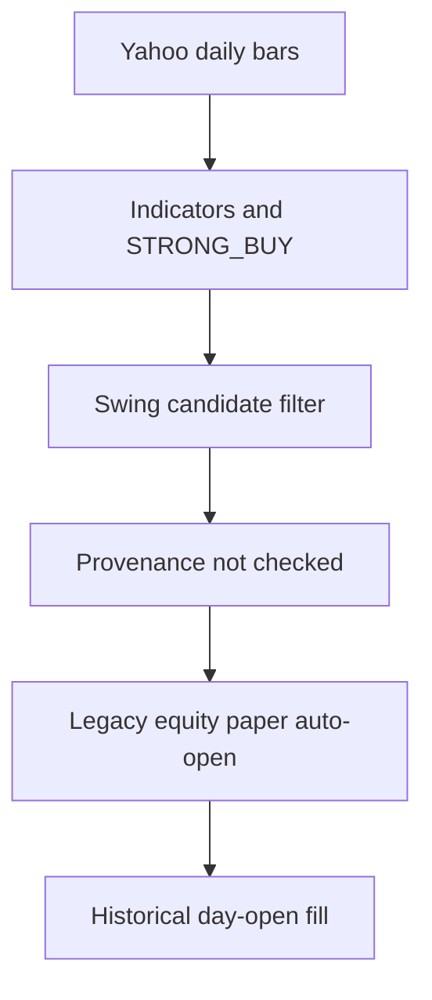
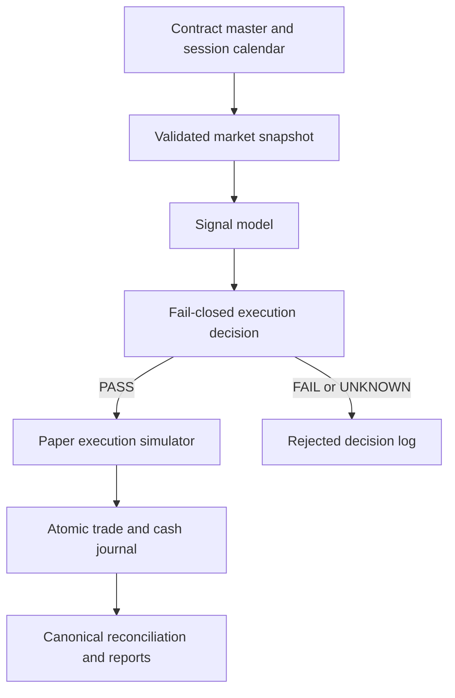

# NSEScanner / MarketScannerByDev — Source-Backed Deep Audit

**Audit date:** 18 July 2026 (IST)  
**Scope:** Uploaded source backup plus previously observed public production behavior  
**Artifact audited:** `marketscannerbydev-src.zip`  
**SHA-256:** `24f946642bae0126424c4752d298de3cda0cf271a64f4659bd1369e535968fc9`  
**Assessment type:** Read-only source, data-flow, trading-methodology, security, accounting, schema, observability, and release-readiness audit  

> This is an engineering and trading-system integrity assessment, not investment advice. No source code, database rows, broker orders, flags, or production settings were changed.

## 1. Executive verdict

**The application is not safe for unattended paper automation or real-money trading in its current state.**

The source confirms that the main problem is not a single bad calculation. Several safety systems exist, but the paths that actually create paper trades can bypass or contradict them. Five findings should be treated as release blockers:

1. **The production expiry calendar is wrong for current BANKNIFTY and SENSEX derivatives.** This can choose the wrong contract, calculate the wrong days-to-expiry, apply expiry risk on the wrong date, and close positions too early or fail to close them on expiry.
2. **The legacy swing auto-entry path consumes Yahoo-derived indicators that the code itself declares unsuitable for signals or trade decisions.** It then records an intraday signal at that day's historical opening price rather than an executable trigger-time price.
3. **The paper F&O cash ledger is not an accounting identity.** Stale-position settlement can close trades without crediting cash, reconciliation ignores capital additions/withdrawals, and two competing reconciliation engines can disagree.
4. **Public mode weakens owner authorization across a broad GET surface.** Subscriber PII/payment metadata, paper books, reports, diagnostics, and system internals are potentially exposed. Plaintext operational credentials are also present in source-backup documentation files.
5. **Several critical F&O controls fail open.** Database/query failures, unavailable option-chain liquidity, invalid timestamps, and missing expected-edge/cost inputs can allow execution to continue without proving that a safety gate passed.

These defects also explain important production symptoms seen during the live audit: a paper-ledger drift of roughly ₹8 lakh, scanner labels that imply Kite trade-grade recommendations even though indicators are Yahoo-derived, a 300% fingerprint-coverage metric, inconsistent health states, and F&O signals blocked for missing spot even while another page displayed a fresh Kite spot.

### Overall readiness

| Capability | Assessment | Current disposition |
|---|---|---|
| Market analysis UI | Useful but contains stale/mislabelled and internally inconsistent data | Allow only with source, session, and freshness labels |
| Swing signal generation | Material provenance, fill-price, and sector-gate defects | **Block automated entries** |
| F&O signal generation | Material expiry, fail-open, calendar, and liquidity defects | **Block automated entries** |
| Paper accounting | Ledger is not reliably reconcilable | Freeze as evidence; repair before new automation |
| Real-money execution | No defensible production release gate | **Keep disabled** |
| Public deployment | Authorization and metadata exposure risks | Disable public mode until redesigned |
| Test/build reproducibility | Incomplete source export | Obtain complete repository before sign-off |

## 2. Scope, method, and evidence quality

### 2.1 What was inspected

The backup was extracted only after archive-path and integrity checks. It contains:

- 1,482 files;
- 1,378 TypeScript/TSX files across the full backup;
- 235 TypeScript test files;
- API routes, scanner UI, trading engines, schemas, diagnostics, reports, and project-memory documentation.

The audit traced the important execution chains rather than judging pages in isolation:

- instrument master → expiry selection → signal gate → sizing → paper open → forced close;
- full NSE scan → provenance → swing candidate → entry/levels → equity paper open;
- paper fill → charges → cash mutation → capital event → reconciliation → reports;
- public-mode switch → global auth → route guards → serialized response;
- provider health → status aggregation → UI claims and observability metrics.

### 2.2 What could not be reproduced

The uploaded backup is not a complete buildable repository. It has no root `package.json`, root lockfile, root TypeScript/test configuration, or Git metadata. Running `npm test` at the source root fails because the root package manifest is absent. Therefore:

- compilation and type checking were **not independently reproducible**;
- the 235 discovered test files were **not executable as a suite** from this backup;
- dependency versions and supply-chain integrity cannot be established;
- deployment commit, branch, migrations, and source/production parity cannot be proven.

This is a limitation of the evidence package, not evidence that the tests fail or pass. A release audit must start from a full Git export or repository access, exact deployed commit SHA, lockfile, environment template, and migration history.

### 2.3 Finding confidence labels

| Label | Meaning |
|---|---|
| Confirmed | Directly demonstrated by source flow or observed production output |
| Confirmed, production impact probable | Direct source defect with a live symptom consistent with it |
| Latent critical | Vulnerable path exists; current data happened not to trigger maximum impact |
| Requires runtime validation | Source concern needs database/provider/replay evidence to quantify |

## 3. Priority summary

| ID | Severity | Finding | Confidence | Immediate action |
|---|---:|---|---|---|
| P0-01 | Stop-ship | BANKNIFTY and SENSEX expiry rules are inconsistent with current exchange rules | Confirmed | Disable affected F&O automation; replace hard-coded calendar |
| P0-02 | Stop-ship | Swing auto-entry violates provenance policy and uses a historical open as the fill | Confirmed | Disable legacy swing auto-open |
| P0-03 | Stop-ship | Paper F&O cash, trades, charges, and capital events do not form one ledger identity | Confirmed; live impact probable | Freeze/snapshot; reconcile before resuming |
| P0-04 | Stop-ship | Public mode bypasses owner GET authorization; secrets exist in backup docs | Confirmed / latent critical | Disable public mode; rotate and scrub secrets |
| P0-05 | Stop-ship | Critical F&O controls fail open on missing/errored evidence | Confirmed | Require explicit PASS for every execution-critical gate |
| P1-01 | High | Two reconciliation engines can report conflicting truth | Confirmed | Consolidate into one canonical engine |
| P1-02 | High | Drawdown and cooldown state is process-local and gross-P&L based | Confirmed | Persist atomically; use net equity |
| P1-03 | High | Duplicate, inaccurate event calendars can block/unblock the wrong session | Confirmed | Central exchange/RBI calendar service |
| P1-04 | High | F&O cost/edge controls receive null inputs and cost schedules disagree | Confirmed | One versioned charge model; calculate before gating |
| P1-05 | High | Scanner's page-level trade-grade badge contradicts row provenance | Confirmed | Derive grade from the weakest signal input |
| P1-06 | High | Scanner universe contains large numbers of non-actionable/no-feed instruments | Confirmed; production impact observed | Authoritative eligibility and series filter |
| P1-07 | High | Pre-market levels can use an extra-stale bar on weekends/holidays | Confirmed; production impact probable | Bind calculations to explicit exchange sessions |
| P1-08 | High | Options education/payoff/recommendation UI contains factual and risk-label errors | Confirmed | Correct exercise/payoff; gate suggestions on data/liquidity |
| P1-09 | High | Reporting mixes periods, gross/net values, and an invalid drawdown denominator | Confirmed; production impact observed | One report scope and account-equity curve |
| P1-10 | High | Runtime `reconciliation_report` table is absent from the schema manifest | Confirmed | Add migration/schema ownership and CI drift check |
| P1-11 | High | Health and coverage metrics can be mathematically or semantically false | Confirmed; production impact observed | Canonical snapshot and bounded metrics |
| P2-01 | Medium | Sector-strength filter is effectively one generic sector | Confirmed | Add authoritative symbol-sector mapping |
| P2-02 | Medium | Static F&O equity universe will drift from current NFO eligibility | Confirmed design risk | Derive from current contract master |
| P2-03 | Medium | Independent array filtering can misalign OHLC bars | Confirmed code risk | Validate complete bars as tuples |
| P2-04 | Medium | Narrative bias and composite bias describe different scores without disclosure | Confirmed | Name both models or make one authoritative |
| P2-05 | Medium | The advertised F37 swing regression gate is diagnostic, not an execution gate | Confirmed | Wire it into execution or rename it |
| P3-01 | Release hygiene | Backup is incomplete and tests encode some wrong business rules | Confirmed | Full reproducible export and dated official fixtures |

## 4. Stop-ship findings

## P0-01 — Current derivative expiry logic is wrong

### Evidence

`artifacts/api-server/src/lib/optionSignals.ts` hard-codes:

- NIFTY weekly expiry: Tuesday;
- BANKNIFTY monthly expiry: last Thursday;
- SENSEX weekly expiry: Tuesday.

The current exchange rules do not match the latter two assumptions:

| Underlying | Code assumption | Current rule relevant to audit | Result |
|---|---|---|---|
| NIFTY | Tuesday | NSE Tuesday | Correct |
| BANKNIFTY | Last Thursday | NSE Tuesday for index derivatives | **Wrong** |
| SENSEX | Tuesday | BSE Thursday contract expiry | **Wrong** |

NSE circular [NSE/FAOP/68747](https://nsearchives.nseindia.com/web/sites/default/files/inline-files/FAOP68747.pdf) moved NSE index and stock derivative expiries to Tuesday for contracts expiring on or after 1 September 2025. NSE's current [equity-derivatives contract specifications](https://www.nseindia.com/static/products-services/equity-derivatives-contract-specifications) list Tuesday for NIFTY, BANKNIFTY, other NSE index derivatives, and individual securities. BSE's current [index-derivatives contract page](https://www.bseindia.com/static/markets/derivatives/derireports/contractindex) documents Thursday expiries for the relevant BSE index contracts.

### Why the impact is larger than a wrong label

The hard-coded result propagates into multiple trading decisions:

1. `expiryFor()` calculates the target expiry.
2. Contract-master resolution selects a contract on or after that target.
3. A wrong BANKNIFTY target can skip the true current-month contract and select the next month.
4. DTE affects premiums, theta rules, regime classification, and sizing.
5. `indexesExpiringTodayIst()` drives expiry-day behavior.
6. The 14:30 expiry force-close consequently fires on the wrong day or misses the real expiry.
7. IV snapshot collection and backtesting use duplicated expiry assumptions.

For SENSEX, this can force-close on Tuesday—two days early—then omit the intended Thursday expiry treatment. For BANKNIFTY, it can miss the actual Tuesday expiry and act as though Thursday were the expiry. The backtest configuration duplicates the wrong weekdays in `artifacts/api-server/src/lib/backtest/directional.ts`, so historical results can validate the same bad assumption instead of detecting it.

Tests such as `optionSignals.expiryDay.test.ts`, `contractMasterFact.test.ts`, and `eventBlackout.test.ts` encode fabricated or outdated dates. These are false-confidence tests: they protect the defect.

### Required fix

- Stop deriving tradable expiries from weekday arithmetic.
- Make the current broker/exchange contract master the authoritative list of actual expiry dates.
- Maintain a versioned official exchange-calendar fallback only for degraded/read-only use.
- Select an expiry only when an exact contract-master match is found; never silently advance from a calculated missing expiry to another contract.
- Persist `expiry_source`, `master_as_of`, `selected_instrument_token`, and rejection reason with every signal.
- Make the same service authoritative for DTE, expiry-day regime, IV snapshots, force-close, UI labels, and backtests.

### Acceptance tests

- Dated fixtures for all listed NSE/BSE underlyings match an official contract-master snapshot.
- BANKNIFTY Tuesday expiry receives expiry-day sizing and 14:30 handling; adjacent Thursday does not.
- SENSEX Thursday expiry receives expiry-day handling; adjacent Tuesday does not.
- Missing exact expiry results in `BLOCKED_CONTRACT_NOT_FOUND`, not next-contract substitution.
- A CI job compares the next eight listed expiries with a fresh master and fails on unexplained drift.

## P0-02 — Swing automation breaches its own data policy and records impossible fills

### Evidence: provenance bypass

`artifacts/api-server/src/lib/scannerProvenance.ts` explicitly classifies Yahoo daily data as delayed/informational and sets `notForSignals=true` and `notForTradeDecisions=true`. The full scanner honestly labels signal provenance as Yahoo because RSI, MACD, SMA, volume ratio, and other indicators are calculated from Yahoo daily bars even where the displayed price comes from Kite.

The actual swing pipeline then bypasses that rule:



- `artifacts/api-server/src/lib/swingSignals.ts` filters on universe membership, `STRONG_BUY`, and score, but does not reject `row.provenance`.
- `computeSwingLevels()` fetches Yahoo daily bars and explicitly marks the levels source as Yahoo/not Kite trade-grade.
- `artifacts/api-server/src/lib/paperTradingEq.ts` opens the resulting signal without a trust/provenance gate.
- A separate, more robust `swingCashRiskGuards.ts` framework exists, but the legacy auto-open path does not invoke it.

This is an architectural bypass: the safety policy exists, but it is not on the execution boundary.

### Evidence: invalid fill model

`swingSignals.ts` assigns the signal entry price from the day's OHLC opening price when available while `triggeredAt` is the current time. The scanner runs during the session. Therefore, a signal first detected at 13:30 can be paper-filled at the 09:15 opening price, a price the system could not execute after the signal existed.

Consequences include:

- artificial entry advantage or disadvantage;
- distorted stops and targets because they are calculated around the wrong entry;
- inaccurate capital allocation, P&L, win rate, expectancy, and drawdown;
- results that cannot be replayed against an executable quote stream.

### Evidence: inert sector gate

`fullNseScanner.ts` assigns the generic value `sector: "NSE EQ"` to every row. `buildSectorStrengthMap()` groups by that truthy value, so the fallback symbol-sector lookup is never used. All equities collapse into one sector and the bottom-quartile sector filter is effectively a no-op.

### Required fix

- Disable `runEquityPaperTradingTick`/legacy swing auto-open until the new execution boundary exists.
- Require a server-side `DataTrustDecision` object. Auto-open must require `PASS`, not the absence of an error.
- Separate signal data, risk data, and execution quote. Record each source and timestamp.
- For same-session entry, fill from a trigger-time bid/ask/quote with configured slippage and latency. Alternatively stage the signal and fill at the next eligible session open, clearly labelling it as a next-open strategy.
- Reject stale, crossed, missing, or informational-only quotes.
- Use an authoritative sector classification. An unknown sector must be `UNKNOWN`, not a universal bucket.
- Build OHLCV indicators only from validated complete-bar tuples; never independently filter arrays.

### Acceptance tests

- A Yahoo-provenance candidate produces `BLOCKED_DATA_NOT_TRADE_GRADE` and no position.
- A signal generated after 09:15 cannot receive the day's 09:15 open as a same-session fill.
- Every recorded fill contains quote timestamp, quote source, bid/ask or LTP policy, slippage, and latency.
- A multi-sector fixture excludes the intended weakest quartile; an unknown mapping follows an explicit policy.
- Restart/replay produces the same signal and execution decision from the same event log.

## P0-03 — Paper F&O cash and trade ledgers do not reconcile by construction

### Evidence

The current rollover path in `artifacts/api-server/src/lib/paperAccount.ts` preserves account balance across days. However, `sweepStaleOpenPaperTrades()` closes prior-day open F&O trades at a last premium **without crediting settlement proceeds back to the account and without applying a complete charge event**. Its comments rely on an older behavior in which cash was reset/refilled daily, but that is no longer how the account behaves.

The rich reconciliation in `paperAccountReconciliation.ts` computes an expected balance approximately as:

```text
seed capital
- capital deployed in open positions
+ lifetime ledger net P&L
```

It omits capital additions and withdrawals. A top-up or withdrawal therefore creates reconciliation drift even if every trade is otherwise correct.

The code also has two charge schedules:

- the reconciliation module contains an older duplicated STT/exchange-fee model;
- the canonical `fnoCostModel.ts` reflects a newer schedule.

An official charge model must be dated and versioned; the current [Union Budget speech](https://www.indiabudget.gov.in/doc/budget_speech.pdf) is one primary reference for the STT policy change, but the implemented calculator should be backed by an explicit effective-date table and regression fixtures.

### Production corroboration

During the public production audit, the rich F&O reconciliation showed drift of about **+₹8,00,644.80**, with displayed cash near ₹10,06,362 against a ₹2,00,000 seed. Recorded net capital movement was only around -₹100, so the omission of capital events is a confirmed formula defect but cannot alone explain the full live discrepancy. Stale settlement, legacy reset behavior, duplicated mutations, missing historical events, or a deployment-version transition must be reconstructed from immutable records.

### Split-brain reconciliation

`eodReconciliation.ts` is a second, weaker engine. It checks open rows, missing P&L, daily gross P&L, and counts, but not the full cash identity, charges, or capital events. It can announce that paper ledgers are consistent while the richer account reconciliation reports major drift.

It also writes a raw runtime table named `reconciliation_report`; that table is not declared in `lib/db/src/schema/runtimeTables.ts`, creating migration/schema-sync risk.

### Required accounting identity

Use one append-only journal where every mutation is a balanced event. At any instant:

```text
cash
+ market value of open positions
+ cumulative withdrawals
- cumulative deposits
= seed capital
+ cumulative realized net P&L
+ cumulative unrealized P&L
```

For closed-only cash reconciliation, settlement proceeds and every fee/tax must appear as explicit journal lines. Do not infer historic cash solely from the current trade table.

### Required fix

- Freeze and snapshot the current paper database before any repair.
- Add append-only events for seed, deposit, withdrawal, reserve/deploy, release/settle, realized P&L, fee/tax, adjustment, and correction reversal.
- Make every open/close transaction atomically update trade, position, cash journal, and charge entries.
- Never delete or overwrite the evidence of a bad mutation; correct with a linked reversal/adjustment.
- Retire the weaker reconciliation result or make both UIs consume the same canonical snapshot.
- Add `reconciliation_report` through a real migration and schema manifest.
- Use net P&L for risk and reporting, with the cost-model version persisted per trade.

### Acceptance tests

- Seed, top-up, withdrawal, open, partial close, stop, expiry settlement, and stale recovery all balance to the paise.
- Re-running a close request is idempotent and cannot double-credit cash.
- A crash between trade close and settlement is recovered through a transaction/outbox without drift.
- Historical reconciliation reports the first event where drift occurred.
- All UIs and alerts display the same reconciliation snapshot ID and result.

## P0-04 — Public-mode authorization bypass and secret exposure

### Evidence: authorization design

`artifacts/api-server/src/lib/auth.ts` bypasses global authentication when public access is enabled. In `lib/userAuth.ts`:

- `requireOwner` permits anonymous GET/HEAD access in public mode;
- `requireSubscriberOrOwner` also bypasses its normal check in public mode;
- only the strict owner guard consistently preserves authentication.

The public-access state is stored in a file-backed cache without a TTL and with module-local caching. In multi-instance deployment it can be inconsistent, and a setting can persist through restart.

The ordinary owner guards protect a broad GET surface—paper accounts, trades, positions, reports, diagnostics, data/status routes, and administrative routes. Most critically, `routes/admin.ts` uses an ordinary owner gate and serializes subscriber email, full name, phone, payment references, amounts, dates, notes, and allowed tabs. Production happened to show zero users during observation, but the path is a **latent critical PII/payment-data exposure** whenever subscribers exist and public mode is enabled.

System-status routes also disclose operational metadata including broker-account identity fragments, API-key prefix, session state, runtime/memory details, and webhook configuration characteristics.

### Evidence: secrets in the backup

The following project-memory files contain plaintext operational credentials or connection information:

- `memory/PRD.md`;
- `memory/test_credentials.md`;
- `memory/STUB_FILES_NEEDED.md`.

The values are intentionally not reproduced in this report. Treat them as compromised because they were included in a transferable backup.

### Required fix

- Disable public mode immediately; do not use an auth bypass to create a public dashboard.
- Introduce explicit public DTO routes with a field allowlist and rate limiting. Default every other route to authenticated/authorized.
- Change the route contract from “GET is harmless” to capability-based authorization; GET endpoints frequently contain sensitive data.
- Store public settings centrally with expiry, audit trail, and consistent multi-instance behavior.
- Rotate app/global access passwords, database credentials, session secret, webhook secret, broker/API secrets, token-encryption keys as applicable, and messaging tokens found in the exposed material.
- Invalidate current sessions/cookies after rotating the session secret.
- Remove secrets from working files and Git history; use environment/secret-manager references and sanitized examples.
- Add pre-commit and CI secret scanning.

### Acceptance tests

- An anonymous test matrix receives 401/403 for every non-public route under every mode.
- Public DTO snapshots contain no user, payment, broker-identity, token, runtime, or configuration metadata.
- Enabling a public dashboard cannot change authorization behavior of existing owner/admin routes.
- Rotated credentials are verified and old credentials fail.

## P0-05 — F&O safety gates fail open

### Evidence

The F&O entry chain neutralizes several gate failures rather than treating missing evidence as unsafe:

- stopped-today and paper-stop queries return zero on database/query error;
- recent-stop failures disable the bias-flip/cooldown effect;
- setup win-rate, relative-strength, and VIX query failures fall back to neutral behavior;
- unavailable/throwing option-chain liquidity data explicitly permits LTP-only continuation;
- invalid timestamps can skip cooldown checks;
- DTE parse failures can produce null and avoid the intended protection;
- `paperTradingFO.ts` passes `expectedGrossEdge: null` and `estimatedCosts: null`, so cost-to-edge and cost-aware theta checks cannot prove the trade is economically viable.

The problem is not that every missing optional metric should block. It is that critical and optional evidence are not typed separately, and “unknown” frequently behaves like “pass.”

### Required fix

Define one immutable execution decision containing every critical control:

| Gate class | Examples | Required behavior |
|---|---|---|
| Critical market identity | spot, instrument token, exact expiry, lot size | UNKNOWN/FAIL → block |
| Critical execution quality | quote freshness, spread, OI/volume policy, market session | UNKNOWN/FAIL → block |
| Critical risk | cash, max loss, DTE, drawdown, cooldown, exposure | UNKNOWN/FAIL → block |
| Critical economics | estimated charges, expected edge, payoff bounds | UNKNOWN/FAIL → block |
| Advisory context | nonessential sentiment/secondary analytics | UNKNOWN → allow only if labelled and policy says optional |

Only an explicit `PASS` for every critical gate may create an order or paper position. Persist gate inputs, outputs, reason codes, data timestamps, and policy versions.

### Acceptance tests

- Injected DB failure in stop/cooldown queries blocks an entry.
- Missing option-chain liquidity blocks an entry instead of switching to LTP-only.
- Invalid DTE or timestamp blocks with a deterministic reason.
- Cost estimate is non-null before the cost/edge gate; high-cost/low-edge fixtures reject.
- A property test proves that no combination containing a critical `UNKNOWN` can produce `OPENED`.

## 5. High-severity findings

## P1-01 — Risk latches are not durable and use gross P&L

Daily/weekly/monthly drawdown latches and similar equity/F&O guards are held in process memory. A restart clears them; replicas can disagree. The drawdown computation sums gross `realized_pnl`, excluding costs, so the risk engine can show more headroom than net account economics justify.

Persist latches and rolling equity atomically in the database, scope them to account/strategy/session, use net P&L, and make resets exchange-session aware. Add restart and concurrent-replica tests.

## P1-02 — Duplicate event calendars are inaccurate and tests protect wrong dates

`paperAccount.ts` and `marketEvents.ts` contain different hard-coded event dates. The blackout table includes approximate or wrong RBI/holiday dates, and `eventBlackout.test.ts` protects at least one wrong date instead of detecting it. A 2026 row even blocks a Saturday while excluding the adjacent actual decision day.

Use a centrally versioned exchange-session and macro-event calendar. Store `source_url`, publication date, effective timestamp, event type, affected products, and manual-review status. RBI dates should be reconciled against official releases such as the [RBI MPC schedule/press release](https://www.rbi.org.in/Scripts/BS_PressReleaseDisplay.aspx?prid=62864). Approximate dates may warn but must not silently become hard execution blocks.

## P1-03 — F27/F37 controls do not match their names

The direction-independent detector cooldown is process-local and resets on restart. It also suppresses an opposite-direction reversal without a durable state transition. The advertised F37 “Swing Regression Gate” is used by a diagnostic GET route but not by the execution path; database failure in that module also fails open.

Either wire these controls into the single execution decision with durable state and ratified semantics, or rename them as diagnostics. Do not report a gate as active when it cannot prevent a trade.

## P1-04 — Page-level scanner grade contradicts signal provenance

The scanner page derives its “KITE TRADE-GRADE” banner mainly from whether Kite is offline. Yet row recommendations are based on Yahoo daily indicators and are marked informational in row provenance. A current Kite quote does not upgrade delayed indicator inputs into a trade-grade signal.

The displayed grade must be the weakest grade among all inputs that materially affect the recommendation. Show separate quote, indicator, fundamental, and execution grades with timestamps; calculate one final `signal_decision_grade` server-side.

## P1-05 — Instrument universe quality makes coverage statistics misleading

The live scanner reported a universe of 8,864 instruments, only 4,340 scanned and 4,528 without feed. `isLikelyTradeableEquity()` uses symbol/name heuristics instead of an authoritative series and eligibility model. Funds, debt-like instruments, inactive/nonordinary series, and aliases can enter the denominator.

Maintain separate concepts:

- exchange master instruments;
- active ordinary cash equities;
- scan-eligible equities;
- current NFO-eligible equities;
- quote-entitled instruments;
- successfully scanned instruments.

Each coverage percentage needs a named denominator and as-of timestamp. Do not advertise completeness against an inflated master count.

## P1-06 — Static F&O universe will become stale

`FNO_EQUITY_UNIVERSE` is hand-maintained and labelled for a financial year. Eligibility, symbols, mergers, and contract availability change. Derive the tradable universe from the current NFO contract master, then apply a reviewed exclusion policy. Keep static data only as a degraded-mode fallback that cannot auto-trade.

## P1-07 — Pre-market support/resistance can be one session too old

`preMarket.ts` independently filters close/high/low arrays and then takes `n-2`, assuming the last bar is the current day. On weekends and holidays, the last available bar is already the prior session, so `n-2` selects an extra-old bar. This is consistent with the production observation that the displayed NIFTY spot was near 24,326 while “next-session” pivots were based on a stale close near 24,072.

Resolve an explicit `target_session`, find its actual previous exchange session, and select one complete OHLCV tuple for that date. Display `levels_based_on_session` and source timestamp.

## P1-08 — Completeness and narrative can be semantically false

Composite-bias completeness measures non-null weight coverage, not freshness or session alignment. A 100% badge can therefore describe fully populated but stale inputs. The displayed composite bias and the narrative are built from different score paths, allowing “Neutral” beside “strong bearish” without explaining that they are different models.

Completeness should include source quality, freshness, session, and semantic validity. Either choose one authoritative score or label both—for example, “Composite market bias” and “Overnight sentiment”—with their individual inputs and timestamps.

## P1-09 — Options strategy education and recommendation semantics are unsafe

The strategy UI says NSE options are American style. NSE states that index and individual-security options are European-style in its current [settlement mechanism](https://www.nseindia.com/static/products-services/equity-derivatives-settlement-mechanism); NSE historical material also records the transition of all index and stock options to European exercise.

The payoff engine first calculates a finite long-put maximum profit, then overrides it to null so the UI renders “Unbounded.” A long put's theoretical maximum profit is finite because the underlying cannot fall below zero:

```text
max profit = (strike - premium) × quantity × lot size
max loss   = premium × quantity × lot size
```

The UI also presents extrema within a ±2σ scenario window as “Max Profit/Max Loss.” Those are scenario-window best/worst values, not theoretical payoff bounds. “Suggested” status is calculated before liquidity quality and can remain actionable when every leg is marked poor liquidity or IV context is unknown.

Corrections:

- fix exercise-style education and dated references;
- preserve finite theoretical long-put maximum profit;
- label ±2σ outputs as scenario best/worst;
- calculate recommendations only after quote freshness, spread, depth/OI, IV, and market-state gates;
- use “educational structure match” when critical market data is unknown.

## P1-10 — Reports mix time scopes and use an invalid drawdown denominator

`paperAnalyticsFO.ts` constructs a cumulative realized-P&L curve starting at zero and calls its peak “peak equity.” `reportsView.ts` divides maximum drawdown by peak cumulative profit instead of peak account equity. In production this produced an 82.8% drawdown from roughly ₹27,430 / ₹33,147, which is not an account drawdown percentage.

The view also chooses the first finite best/worst value, so a zero from a current-period report overrides a nonzero lifetime value. Cards, analytics, and the table use different periods; production showed 28 F&O plus 9 equity trades while the visible monthly table showed only the 9 equity rows.

Every report needs one explicit filter contract: account, strategy, product, gross/net, date range, timezone, inclusion status, and generated-at snapshot. Drawdown must use peak net account equity including the declared capital-event policy.

## P1-11 — Observability metrics can be impossible

F&O fingerprint coverage divides downstream decisions by a denominator that excludes upstream rows, but its numerator counts all fingerprinted rows. The result can exceed 100%; production displayed 300%. Filter numerator and denominator to the same population and assert the invariant `0 ≤ coverage ≤ 100`.

The service also has several competing health definitions. `/healthz` always returns `status: ok` without checking dependencies, while System Status and Infrastructure Health use different database/provider checks and latencies. Production showed FAIL/DEGRADED alongside “all operational.”

Create one canonical health snapshot with an ID, component states, timestamps, latency, error class, and readiness policy. Liveness should mean “process is alive”; readiness should fail when execution-critical dependencies are unavailable. All pages must consume the same snapshot.

## P1-12 — Schema ownership is incomplete

The source explicitly lists several raw runtime tables in `runtimeTables.ts` to prevent schema tools from dropping them, but omits `reconciliation_report`. Add it via a reviewed migration and make every runtime table owned by one schema/migration path. CI should perform a dry-run diff against a disposable database and fail on unmanaged objects.

## 6. Additional data and methodology defects

### 6.1 OHLC array misalignment

Some calculations independently filter close, high, low, and volume arrays. If one field is null in one bar, the resulting arrays can refer to different sessions at the same index. Parse bars as `{session, open, high, low, close, volume}` tuples, reject/flag incomplete bars, sort once, and calculate only over aligned tuples.

### 6.2 Market-session handling is fragmented

Weekend checks, manual IST offsets, expiry weekdays, RBI events, holidays, and EOD scheduling are duplicated. EOD skips weekends but not exchange holidays. Replace them with one session service capable of answering:

- whether a timestamp is in an eligible exchange session;
- the previous/next valid session;
- market open/close and special sessions;
- actual listed expiry from the contract master;
- which session owns a candle or report.

Use an IANA timezone (`Asia/Kolkata`) and store timestamps in UTC plus explicit exchange session date.

### 6.3 Equity sizing is not directly risk-budget based

Equity paper sizing divides capital/book value across available slots, with portfolio heat caps layered around it. That is not the same as determining quantity from entry-to-stop loss and a per-trade risk budget. Move to:

```text
risk_rupees = min(account_equity × risk_pct, remaining_portfolio_heat)
quantity    = floor(risk_rupees / (entry_price - stop_price + estimated_cost_per_share))
```

Then cap by liquidity, position concentration, gap-risk policy, and available settled cash.

### 6.4 Live F&O sizing is contaminated by bad cash

F&O sizing is dynamic and risk-based with fixed lots acting as a ceiling, but available paper cash is part of its risk base. The observed inflated cash can therefore inflate allowed risk and make ceiling-sized trades more likely. Fix ledger truth before evaluating whether the sizing percentages are conservative.

### 6.5 Mixed freshness across pages

Production showed a fresh Kite spot on Option Chain/OI Lab while F&O diagnostics reported `SPOT_UNAVAILABLE`; the options page showed zero setups while Paper showed three “today” signals. These likely represent separate caches, providers, or snapshot times. Every cross-page object must carry `snapshot_id`, `source`, `as_of`, `market_session`, and `freshness_state`, and the UI must not combine incompatible snapshots as if they are current truth.

### 6.6 Saturday signal/event persistence

Production displayed Saturday signal events. That may be a reporting/session-attribution issue rather than actual weekend execution, but it must be made unambiguous. Persist `generated_at`, `source_market_session`, `eligible_execution_session`, and `market_open_state`; group daily reports by exchange session, not server-local calendar day.

## 7. Production symptom-to-source reconciliation

| Live symptom | Source explanation or likely path | Assessment |
|---|---|---|
| F&O cash drift ≈ +₹8.0 lakh | stale-settlement cash omission, incomplete capital identity, competing recon engines, possible legacy transitions | Source confirms mechanisms; DB event reconstruction required for exact amount |
| July gross profit but estimated net loss after costs | reports and risk paths mix gross/net; cost inputs null in key gates | Confirmed design defect |
| 0% decisive P25 win rate with one opened signal | extremely small outcome sample despite hundreds emitted | Not proof of alpha failure; proof that displayed success claims need cohort definitions |
| Best/worst trade ₹0 despite activity | zero current-period value overrides lifetime analytics | Confirmed |
| 82.8% maximum drawdown | drawdown divided by peak cumulative profit, not peak account equity | Confirmed |
| “KITE TRADE-GRADE” with Yahoo informational indicators | banner keys off Kite connection; signal provenance remains Yahoo | Confirmed |
| 8,864 universe / 4,528 no-feed | heuristic universe admits ineligible/nonfeed instruments | Confirmed design; exact members need runtime export |
| Progress 0/8,864 after scan | incoherent/cached progress snapshot; exact reset race not proven from backup | Requires runtime tracing |
| Stale next-session pivots | `n-2` assumption on weekend/holiday | Confirmed, impact probable |
| Neutral score beside strong-bearish narrative | two separate scoring paths | Confirmed |
| “Suggested” strategies with poor liquidity | recommendation computed without a hard leg-quality gate | Confirmed |
| Infrastructure FAIL while System Status operational | multiple health definitions and shallow `/healthz` | Confirmed |
| Fingerprint coverage 300% | numerator and denominator use different populations | Confirmed |

## 8. Remediation roadmap

The order matters. Do not begin by tuning strategies or adding indicators. First restore contract identity, data trust, accounting truth, authorization, and fail-closed execution.

## Phase 0 — Containment before the next automated session (same day)

1. Disable all swing and F&O auto-open flags. Keep broker/live execution disabled.
2. Explicitly block BANKNIFTY and SENSEX F&O automation; preferably block all F&O automation until exact-expiry resolution is deployed.
3. Disable public mode. Place the application behind authenticated owner access.
4. Rotate exposed secrets and invalidate existing sessions.
5. Take immutable database and configuration snapshots, including paper accounts, trades, positions, charges, capital events, audit events, and deployed commit/environment metadata.
6. Stop automatic “repair” or balance reset jobs. Preserve the evidence trail.
7. Add a visible product banner: analysis-only / automation suspended / data provenance limitations.

**Exit condition:** no autonomous open can occur; sensitive routes are authenticated; a recovery snapshot exists.

## Phase 1 — Correct trading identity and accounting (0–2 working days)

1. Build one contract-master-driven expiry service and route every consumer through it.
2. Add one exchange-session calendar service; remove hard-coded weekdays and duplicate event tables from decision paths.
3. Replace paper cash mutations with an append-only, balanced journal and idempotent transactional commands.
4. Reconstruct current paper history in a read-only audit job; identify the first drift event and quantify categories.
5. Consolidate reconciliation; add the missing schema migration and exact cash/equity invariants.
6. Make the cost model effective-date/version aware and use it everywhere.

**Exit condition:** dated expiry fixtures pass and every seeded ledger scenario balances to the paise across restart/retry.

## Phase 2 — Put safety on the execution boundary (2–5 working days)

1. Create one fail-closed `ExecutionDecision` contract for both swing and F&O.
2. Wire data trust, quote freshness, session, liquidity, expiry, risk, cooldown, drawdown, charges, and edge into that contract.
3. Replace historical-open swing fills with a documented executable fill model.
4. Add authoritative sectors and contract-master-derived NFO eligibility.
5. Persist risk latches/cooldowns atomically and base them on net account equity.
6. Eliminate independent OHLC array filtering.

**Exit condition:** fault injection proves missing critical evidence cannot open a position, and deterministic replay reproduces every decision reason.

## Phase 3 — Repair truth presented to the user (5–10 working days)

1. Create one provenance/freshness model used by scanner rows, banners, signals, and reports.
2. Correct pre/post-market session binding, score naming, and freshness-aware completeness.
3. Correct option exercise/payoff content and liquidity-aware suggestion semantics.
4. Rebuild performance reporting around explicit scope and net account equity.
5. Replace multiple health definitions with one liveness/readiness snapshot.
6. Correct coverage populations and add range/invariant assertions.

**Exit condition:** cross-page snapshot tests show the same source/as-of/status/accounting values, and every percentage is mathematically bounded.

## Phase 4 — Reproducibility and shadow validation (1–3 weeks)

1. Obtain the full repository, exact deployment SHA, root manifests, lockfile, migrations, and environment template.
2. Establish clean install, typecheck, unit, integration, database migration, and end-to-end CI.
3. Replace structural/string tests with behavior tests and dated official exchange fixtures.
4. Run at least 20 exchange sessions in shadow mode with no autonomous execution.
5. Reconcile every session automatically; require zero unexplained drift.
6. Compare generated signals with broker-grade timestamps and executable quotes; report rejection reasons and slippage.

**Exit condition:** all release gates in Section 10 pass for the same commit and environment.

## Phase 5 — Controlled paper canary, then separate live approval

1. Enable one strategy and one product class only, with very small capped paper risk.
2. Require manual approval initially and a kill switch independent of the app process.
3. Expand only after predeclared sample sizes, data-quality, reconciliation, and incident criteria pass.
4. Treat real-money activation as a separate security/risk review. Paper success alone is not authorization.

## 9. Implementation ticket map

| Ticket | Primary area/files | Deliverable | Key acceptance evidence | Dependency |
|---|---|---|---|---|
| T01 | `optionSignals.ts`, contract master, directional backtest | Exact listed-expiry service | NSE/BSE dated fixtures; missing exact match blocks | None |
| T02 | `paperTradingFO.ts`, expiry force-close | Master-driven DTE/force-close | Tuesday BANKNIFTY and Thursday SENSEX cases | T01 |
| T03 | session/event utilities, `marketEvents.ts`, `paperAccount.ts` | One exchange/event calendar | holiday/weekend/RBI fixture suite | T01 |
| T04 | paper account/trades/charges schemas | Append-only balanced journal | Paise-level invariant + idempotency/crash tests | DB snapshot |
| T05 | reconciliation modules | One canonical reconciliation snapshot | Both UI/API consume identical snapshot ID | T04 |
| T06 | `runtimeTables.ts`, migrations | Schema ownership for runtime tables | disposable-DB migration/diff green | T04 |
| T07 | `swingSignals.ts`, `paperTradingEq.ts`, provenance | Fail-closed swing decision | Yahoo candidate blocked; trust evidence stored | T01/T03 |
| T08 | equity execution simulator | Trigger-time/next-open fill model | no pre-signal fill; slippage evidence | T07 |
| T09 | sector/universe services | Authoritative sector and NFO eligibility | coverage and sector exclusion fixtures | Contract master |
| T10 | `optionSignalGates.ts`, `paperTradingFO.ts` | Fail-closed F&O decision | DB/chain/DTE fault injection blocks | T01/T03 |
| T11 | `fnoCostModel.ts` and reconciliation/report consumers | Versioned canonical costs | official effective-date fixtures | T04 |
| T12 | risk guards/state tables | Durable net-equity latches | restart/multi-replica tests | T04 |
| T13 | auth/public routes/admin/status | Explicit public DTO surface | anonymous authorization matrix | Immediate |
| T14 | secret management | Rotation and history scrub | old credentials rejected; scanner green | Immediate |
| T15 | pre/post market services | Session-bound aligned OHLC | weekend/holiday and null-bar fixtures | T03 |
| T16 | scanner API/UI provenance | Component and final data grade | banner cannot exceed weakest input | T07 |
| T17 | options strategy engine/UI | Correct payoff and recommendation gate | payoff property tests; poor liquidity not suggested | T10/T11 |
| T18 | report analytics/UI | Scoped net-equity reporting | known-account fixture, correct DD and best/worst | T04/T05 |
| T19 | health/observability | Canonical readiness and bounded metrics | injected outage; 0–100 coverage property | None |
| T20 | repository/CI | Reproducible clean build and tests | locked clean install + migration + E2E | Full repository |

## 10. Mandatory release gates

No paper automation should resume until gates 1–9 pass. No real-money automation should resume without all gates and a separate operational approval.

1. **Expiry integrity:** next eight actual expiries per supported underlying match the current contract master.
2. **Session integrity:** all timestamps map to the correct exchange session across weekends, holidays, and expiry days.
3. **Data trust:** every execution decision identifies source/as-of/grade; critical `UNKNOWN` blocks.
4. **Executable fills:** no fill predates the signal; every fill has a documented price and slippage model.
5. **Accounting:** zero unexplained cash/equity drift to ₹0.01 in unit, integration, replay, and daily reconciliation.
6. **Cost integrity:** every trade has a versioned, non-null charge estimate before entry and realized costs at exit.
7. **Authorization:** anonymous route matrix exposes only explicit public DTOs; secrets scan is clean and rotations verified.
8. **Durability:** cooldowns, drawdown stops, and kill switches survive restart and agree across replicas.
9. **Observability:** one readiness snapshot; metrics cannot exceed mathematical bounds; alerts identify stale/unknown data.
10. **Reproducibility:** clean checkout/install/typecheck/test/migrate/E2E succeeds from the lockfile for the deployed SHA.
11. **Shadow evidence:** minimum 20 exchange sessions with zero unexplained reconciliation drift and no critical fail-open event.
12. **Canary control:** one-strategy capped paper canary, manual kill switch, rollback runbook, incident owner, and audit log.

## 11. Safe investigation queries and evidence to export

Before any data correction, export immutable copies of:

- paper account state and every balance mutation/audit row;
- F&O/equity trades and positions, including all status transitions;
- capital additions/withdrawals;
- charge/tax rows and cost-model version if present;
- signal events, rejection reasons, provenance, quote timestamps, expiry, and instrument tokens;
- reconciliation reports and EOD runs;
- system mode/public mode change audit;
- deployment SHA and migration history.

Run read-only checks tailored to the actual schema:

```sql
-- 1. Inventory all paper trade status/count/value by product and day.
SELECT product_type, status, DATE(created_at) AS d,
       COUNT(*) AS rows,
       SUM(COALESCE(realized_pnl, 0)) AS gross_realized,
       SUM(COALESCE(net_pnl, 0)) AS net_realized
FROM paper_trades
GROUP BY product_type, status, DATE(created_at)
ORDER BY d, product_type, status;

-- 2. Find closed rows missing economic fields.
SELECT id, symbol, status, opened_at, closed_at,
       entry_price, exit_price, quantity, realized_pnl, net_pnl
FROM paper_trades
WHERE status <> 'OPEN'
  AND (closed_at IS NULL OR exit_price IS NULL OR realized_pnl IS NULL);

-- 3. Inspect capital events in chronological order.
SELECT *
FROM paper_capital_events
ORDER BY created_at, id;

-- 4. Identify unexpected listed expiry weekdays from captured signal facts.
SELECT underlying, expiry_date,
       EXTRACT(ISODOW FROM expiry_date) AS iso_weekday,
       COUNT(*) AS signals
FROM option_signal_events
GROUP BY underlying, expiry_date
ORDER BY expiry_date, underlying;
```

The table/column names must be adapted to the deployed schema. These examples are intentionally read-only. Do not “fix” the ₹8 lakh drift with a direct balance update; reconstruct the first bad event and issue a documented journal correction after backup and review.

## 12. Test strategy that will catch the current class of defects

### 12.1 Official-fact fixture tests

- Store dated, checksummed snapshots of exchange instrument masters.
- Store the circular/source URL and effective dates with each business-rule fixture.
- Fail tests when a fixture expires or the future contract master diverges.
- Do not fabricate dates merely to exercise a weekday.

### 12.2 Property and invariant tests

- critical `UNKNOWN` can never yield an open decision;
- no fill timestamp/price observation predates signal generation;
- `0 ≤ percentage ≤ 100` for coverage/completeness;
- long-put payoff is bounded and matches payoff at underlying zero;
- ledger debits equal credits for every event and sequence;
- replaying an idempotency key cannot mutate cash twice;
- bar arrays remain session-aligned under arbitrary missing fields.

### 12.3 Fault injection

Inject failures in DB reads, provider timeouts, empty option chain, stale quote, missing instrument, invalid timezone/date, partial transaction, process restart, and replica concurrency. A safety test is incomplete if it only tests valid data.

### 12.4 Golden end-to-end sessions

Maintain replayable sessions for:

- ordinary Tuesday;
- BANKNIFTY/NIFTY Tuesday expiry;
- SENSEX Thursday expiry;
- exchange holiday and weekend;
- RBI event session;
- gap open, halted/illiquid instrument, and stale feed;
- capital top-up/withdrawal plus open/close and restart.

## 13. Target architecture

The target should have three independent truth boundaries:

1. **Market fact boundary:** instrument master, exchange calendar, market session, data provenance/freshness.
2. **Execution decision boundary:** all critical gates produce explicit PASS/FAIL/UNKNOWN and one auditable reasoned decision.
3. **Accounting boundary:** atomic append-only journal and positions reconcile into one account-equity snapshot.



UI components must consume these immutable snapshots rather than recomputing their own version of truth.

## 14. Source evidence index

Line ranges below refer to the uploaded source snapshot. They are included to make remediation review faster; the surrounding function and its callers should be reviewed, not only the cited lines.

| Finding | Primary source location |
|---|---|
| Current expiry constants | `artifacts/api-server/src/lib/optionSignals.ts:58-75` |
| Expiry-day/force-close consumer | `artifacts/api-server/src/lib/optionSignals.ts:2143-2159`; `artifacts/api-server/src/lib/paperTradingFO.ts` expiry-close block |
| Backtest duplicate weekdays | `artifacts/api-server/src/lib/backtest/directional.ts:52-54` |
| Yahoo explicitly prohibited for signals/trades | `artifacts/api-server/src/lib/scannerProvenance.ts:7-10,154-168` |
| Scanner assigns Yahoo signal provenance | `artifacts/api-server/src/lib/fullNseScanner.ts:482-493` |
| Generic `NSE EQ` sector assignment | `artifacts/api-server/src/lib/fullNseScanner.ts:403,480` |
| Historical day-open swing entry | `artifacts/api-server/src/lib/swingSignals.ts:290-291` |
| Yahoo swing levels | `artifacts/api-server/src/lib/swingSignals.ts:345-363` |
| Candidate filter omits provenance | `artifacts/api-server/src/lib/swingSignals.ts:372-381` |
| Legacy equity paper opener | `artifacts/api-server/src/lib/paperTradingEq.ts:191+`; auto-open tick at `1019-1042` |
| Public global-auth bypass | `artifacts/api-server/src/lib/auth.ts:113-123` |
| Public-mode owner/subscriber bypass | `artifacts/api-server/src/lib/userAuth.ts:220-243,273-310` |
| Public-access file/cache design | `artifacts/api-server/src/lib/publicAccess.ts` |
| Admin PII/payment serialization | `artifacts/api-server/src/routes/admin.ts:29-49` |
| Balance rollover behavior | `artifacts/api-server/src/lib/paperAccount.ts:541-564` |
| Stale-trade sweep without cash settlement | `artifacts/api-server/src/lib/paperAccount.ts:605-640` |
| Process-local drawdown latches | `artifacts/api-server/src/lib/paperAccount.ts:938-1080` |
| Hard-coded event blackout table | `artifacts/api-server/src/lib/paperAccount.ts:164-180` |
| Expected-balance formula | `artifacts/api-server/src/lib/paperAccountReconciliation.ts:320-364` |
| Duplicated reconciliation fee schedule | `artifacts/api-server/src/lib/paperAccountReconciliation.ts:114-158` |
| Weaker second reconciliation engine/table | `artifacts/api-server/src/lib/eodReconciliation.ts:55-69` and surrounding checks |
| Runtime schema manifest omission | `lib/db/src/schema/runtimeTables.ts` |
| F&O null edge/cost inputs | `artifacts/api-server/src/lib/paperTradingFO.ts:702-703` |
| Recent-stop fail-open | `artifacts/api-server/src/lib/paperTradingFO.ts:741-745` |
| Option-chain unavailable → LTP-only continuation | `artifacts/api-server/src/lib/paperTradingFO.ts:791-814` |
| Other fail-open gate fallbacks | `artifacts/api-server/src/lib/optionSignalGates.ts:171-176` and adjacent gate queries |
| Pre-market previous-bar assumption/alignment | `artifacts/api-server/src/lib/preMarket.ts:424-499` |
| Completeness ignores freshness | `artifacts/api-server/src/lib/compositeBias.ts:219-303` |
| Long-put finite value then override | `artifacts/api-server/src/lib/optionStrategies.ts:1262-1277` |
| Recommendation precedes leg quality | `artifacts/api-server/src/lib/optionStrategies.ts:1283-1290,1380-1415` |
| Report first-finite/zero behavior | `artifacts/scanner/src/lib/reportsView.ts:431-504` |
| Invalid drawdown percentage denominator | `artifacts/scanner/src/lib/reportsView.ts:1196-1197` |
| Fingerprint numerator/denominator mismatch | `artifacts/api-server/src/routes/paper.ts:965-973,1046-1051` |
| Shallow liveness endpoint | `artifacts/api-server/src/routes/health.ts` |
| Independent system-health implementation | `artifacts/api-server/src/lib/systemStatus.ts` |
| Incorrect NSE option exercise education | `artifacts/scanner/src/pages/strategies.tsx:231` |
| Scenario window labelled max profit/loss | `artifacts/scanner/src/pages/strategies.tsx:558-668` |

## 15. Authenticity and limitations

This report distinguishes direct source evidence, production corroboration, and items requiring runtime reconstruction. It does **not** claim that:

- the exact ₹8 lakh drift was caused by only one identified line;
- the progress 0/8,864 symptom has a proven single root cause;
- all 235 tests fail or pass;
- the uploaded backup exactly matches the deployed production commit;
- a profitable or safe strategy can be inferred from the current small decisive sample.

Those questions require the complete repository, deployed SHA, provider snapshots, and a read-only production database export. The confirmed stop-ship defects do not depend on those missing items and should be contained immediately.

## 16. Primary external references

- [NSE circular NSE/FAOP/68747 — revision in expiry day](https://nsearchives.nseindia.com/web/sites/default/files/inline-files/FAOP68747.pdf)
- [NSE equity-derivatives contract specifications](https://www.nseindia.com/static/products-services/equity-derivatives-contract-specifications)
- [BSE index-derivatives contract information](https://www.bseindia.com/static/markets/derivatives/derireports/contractindex)
- [NSE equity-derivatives settlement mechanism](https://www.nseindia.com/static/products-services/equity-derivatives-settlement-mechanism)
- [NSE Master Data technical specifications](https://nsearchives.nseindia.com/web/sites/default/files/inline-files/NSE_MasterData_Technical_Specifications.pdf)
- [RBI MPC schedule/press-release reference](https://www.rbi.org.in/Scripts/BS_PressReleaseDisplay.aspx?prid=62864)
- [Union Budget speech reference for effective-date cost policy](https://www.indiabudget.gov.in/doc/budget_speech.pdf)

---

**Bottom line:** keep analysis available with honest provenance labels, but suspend autonomous entries. Repair expiry identity, ledger truth, authorization/secrets, and fail-closed execution before tuning strategies or evaluating profitability.
